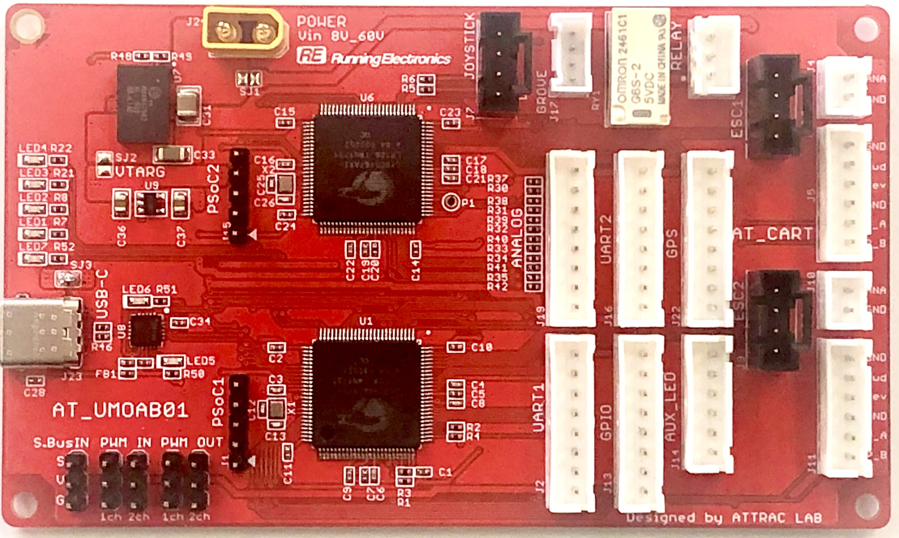
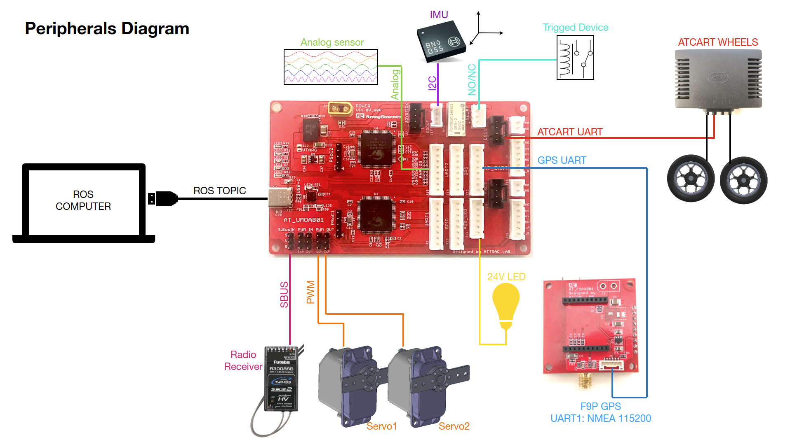
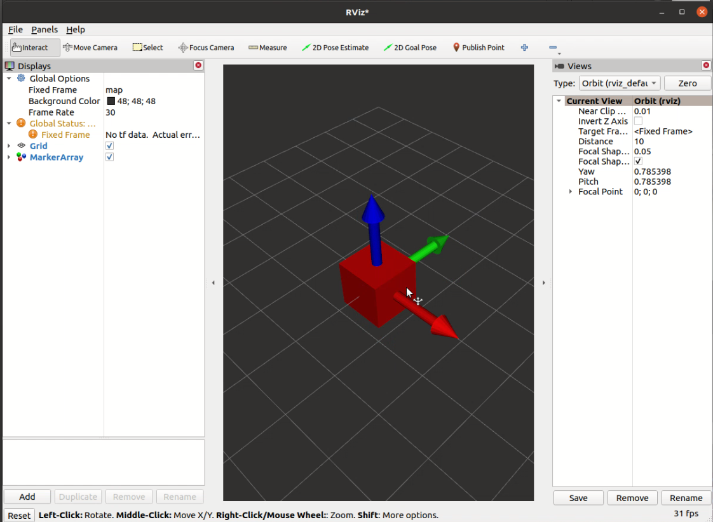

# UMOAB ROS1-ROS2 converter



UMOAB is an interface board which allow user to connect peripherals like 

- ATCart wheels
- BNO055
- Ublox F9P GPS
- RC Receiver (SBUS)
- Relay
- 24V LEDs
- RC servo motor
- Analog sensors
- Relay trigged device 

and get data or control those devices via ros topic.



The board is connecting to host computer via USB type C.

## Setup

As default, UMOAB can be used on ROS1, so we need to install a package of ros1_bridge in order to let UMOAB porting the topic data to ROS2.

Note that, I am using ROS distro as `noetic` for ROS1 and `foxy` for ROS2, my local packages environment for ROS1 is `catkin_ws`, and for ROS2 is `dev_ws`.

- Install ROS1 and ROS2 as usual, and create enviroment as `catkin_ws` and `dev_ws`.

- clone [ros1_bridge](https://github.com/ros2/ros1_bridge) package to your ros2 environment (dev_ws).

- clone this `umoab_ros2_converter` repo into `dev_ws`, then `colcon build --symlink-install`.

- no need to put source enviroment `setup.bash` on to `~/.bashrc` like usual

- install pyserial `sudo pip3 install pyserial`

- make sure the computer can access USB device, `sudo usermod -a -G dialout $USER`

- install rosserial_python, `sudo apt-get install ros-noetic-rosserial-python`

## Run

When I mention to source ROS1 environment, we need to run these

```sh
source /opt/ros/noetic/setup.bash
source ~/catkin_ws/devel/setup.bash
export ROS_MASTER_URI=http://localhost:11311
export ROS_IP={your_pc_IP}
export ROS_HOSTNAME=$ROS_IP
```
And when I mention to source ROS2 environment, we need to run these

```sh
source /opt/ros/foxy/setup.bash
source ~/dev_ws/devel/setup.bash
export ROS_MASTER_URI=http://localhost:11311
export ROS_IP={your_pc_IP}
export ROS_HOSTNAME=$ROS_IP
```

The step to run is same as explained on [ros1_bridge readme](https://github.com/ros2/ros1_bridge#readme), if you haven't used it before, please check on the step below.

```sh
# Terminal 1
# source ROS1 env., and run roscore
roscore

# Terminal 2
# source ROS1 and ROS2 envs., and ros ros1_bridge
ros2 run ros1_bridge dynamic_bridge

# Terminal 3
# source ROS1 env., and run rosserial_python
rosrun rosserial_python serial_node.py _port:=/dev/ttyUSB0 _baud:=921600

# Terminal 4
# source ROS2 env., and run umoab_ros2_converter pubsub
ros2 run umoab_ros2_converter pubsub

```

So now `umoab/*` topic should be ported to ROS2 environment, so you can check it by

```sh
# Terminal 5
# source ROS2 env., then

ros2 topic list # to check available topics

# Try publishing data from command line
ros2 topic pub --once /umoab/relay std_msgs/msg/Bool "data: True" # to trig the relay on

ros2 topic pub --once /umoab/relay std_msgs/msg/Bool "data: False" # to trig the relay off

ros2 topic pub --once /umoab/cart_cmd std_msgs/msg/Int16MultiArray "data: [1200, 1024]" # to spin left wheel of ATCart forward in auto mode

ros2 topic pub --once /umoab/cart_cmd std_msgs/msg/Int16MultiArray "data: [1024, 900]" # to spin right wheel of ATCart backward in auto mode

# If GPS is connected
ros2 topic echo /umoab/gps # This should print NavSatFix message of GPS

# If BNO055 is connected
ros2 topic echo /umoab/imu # This should print Imu message of BNO055


# If you would like visualize IMU in Rviz2
ros2 run umoab_ros2_converter imu_vis

# Terminal 6
# source ROS2 env., and ros rviz2
rviz2
# add topic to visualize as MakerArray and select /umoab/imu_marker
# ther should be a box displaying on screen.
```



